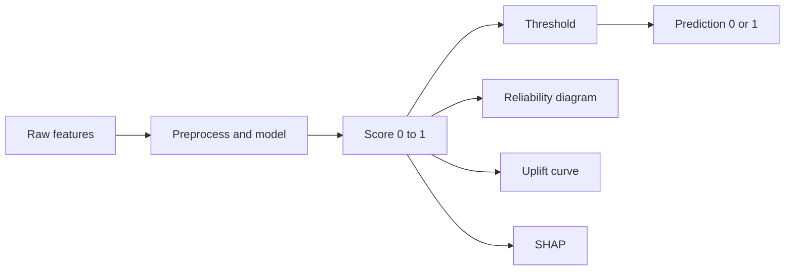

# Interpretation guide — Neybor conversion model outputs

Plain-language cheat sheet for a **junior ML engineer**. The pipeline trains a classifier on Salesforce-style application data and evaluates it on a **time-based hold-out** (no peeking into the future).

---

## 1. What the model actually gives you

| Output | Meaning |
|--------|---------|
| **Score** (a number between 0 and 1) | Estimated **probability or confidence** that this application will convert (completed), *according to this model*. It is learned from patterns in past data—not a guaranteed truth. |
| **Prediction** (0 or 1) | Answer to: “Is the score **at or above** the chosen cutoff?” Built from the score plus a **threshold** picked on validation data—not from the calibration plot. |

**One sentence:** The model ranks “who looks more likely to convert” using features you fed it; the score is useful for ranking and dashboards, but it is only as honest as calibration and sample size allow.

---

## 2. Reliability diagram — `reports/tables/{model}_holdout_reliability.png`

**Question it answers:** *When the model says “about X%”, do outcomes look like X% in reality?*

### How to read the chart

1. **Horizontal axis (mean predicted probability)**  
   You sort hold-out rows by model score, group them into **bins** (buckets of similar scores), and take the **average score** in each bin. So each point is “this group was scored around this level.”

2. **Vertical axis (observed conversion rate)**  
   In that same bin, what **fraction truly converted** (target = converted)? That is “what actually happened.”

3. **Dashed diagonal (perfect calibration)**  
   Fantasy world: predicted 40% ⇒ 40% converted. If the orange line traced this dashed line, probabilities would match reality bucket by bucket.

4. **Orange line (your model)**  
   Shows **gaps** between what the model said and what happened. Away from the diagonal means **miscalibration** for those score ranges.

### Why your line might look zig-zaggy

| Effect | Explanation |
|--------|-------------|
| **Small bins** | If few rows land in a bin, one extra conversion can swing the observed rate from 0% to 100%. That produces sharp spikes—not always “bad model,” sometimes **noise**. |
| **Random Forests** | Tree ensembles are often **good at ranking** who is more likely to convert, but **not automatically well-calibrated** as probabilities. Jagged reliability curves are common. |
| **Use case** | If you only need **prioritisation** (“call top scores first”), calibration matters less than ranking. If you need **risk budgets or € amounts** tied to percentages, apply **probability calibration** (e.g. isotonic regression) on validation data—out of scope of this guide, but that’s the fix. |

**Companion CSVs:**

- `{model}_holdout_summary.csv` — summary numbers (e.g. Brier score, expected calibration error). Lower is typically better for calibration-focused metrics when comparing models honestly on the same hold-out.
- `{model}_holdout_bins.csv` — per-bin counts and gaps. Use **column `n`** to see whether a weird point is backed by five rows or five hundred.

---

## 3. Operational uplift simulation — `reports/tables/{model}_holdout_capture_curve.png`

**Question:** *If we only pursued the **top-scoring** X% of leads, what **share of all conversions** would we catch compared to chasing leads at random?*

- **Orange (model ranking):** Sort everyone by score (highest first), walk down the list, plot “share contacted” vs “share of conversions found so far.”
- **Dashed (uniform baseline):** If we contacted leads at random, catching 20% of people would roughly find ~20% of conversions—often used as a naïve reference.

Above the dashed line ⇒ the ranking **beats random contact** at that budget.

**Companion:** `{model}_holdout_deciles.csv` breaks this into deciles with counts and uplift numbers.

---

## 4. SHAP — explain “why this score?” (post-preprocessing features)

These plots explain the **fitted model**, on the **numeric design matrix after encoding** (one-hot categories, scaled numerics, etc.). Names look like engineered + encoded columns, not raw Salesforce picklists verbatim.

| File pattern | What it shows |
|--------------|----------------|
| `{model}_holdout_shap_global_bar.png` | **Global:** which encoded features tend to push scores up/down on average (magnitude). |
| `{model}_holdout_shap_global_beeswarm.png` | **Global:** same idea with spread—how values and direction of effect vary across rows. |
| `{model}_holdout_shap_global_importance.csv` | Table of mean |SHAP| per feature. |
| `{model}_holdout_shap_local_waterfall_*.png` | **Local:** waterfall for individual rows—drivers for **that** prediction. |
| `{model}_holdout_shap_local_drivers.csv` | Top contributing features per explained row (from a small batch at the **start** of the test set—see pipeline code). |

**Junior pitfall:** SHAP explains the **black box**, not causal business truth. Strong SHAP ≠ “changing this feature in CRM will lift conversion”; it means “this pattern correlates with the model’s behaviour.”

---

## 5. Fairness / group sensitivity — `reports/tables/{model}_holdout_group_sensitivity.csv`

**Question:** *Do scores or error rates differ a lot across **sensitive groups** (e.g. geography, unit type—whatever is in `SENSITIVE_FIELDS`)?*

Read it as a **sanity check** for uneven treatment or data sparsity in subgroups, not as a full fairness audit. Small groups will again be noisy.

---

## 6. Model choice and metrics (tables)

| File | Purpose |
|------|---------|
| `reports/tables/temporal_cv_model_selection.csv` | Cross-validation **inside the training period**: which model and threshold were chosen **without** using the final hold-out. |
| `reports/tables/model_comparison.csv` | Final **hold-out** metrics for the **selected** model (with the fixed threshold), e.g. precision, recall, PR-AUC style summaries—depends on `metrics_to_dataframe`. |
| `data/processed/holdout_predictions.csv` | Row-level: true label, score, binary prediction. |
| `data/processed/feature_columns.csv` | Which columns were used as model inputs. |
| `reports/tables/fill_rates.csv` | How empty each input column was before modelling—helps interpret weak signals. |

---

## 7. Mental model (flow)

- **Reliability / Brier / ECE:** “Are the **numbers** honest as probabilities?”
- **Uplift curve:** “Is **ranking** useful for operations?”
- **Classification metrics at a threshold:** “How often are we right / wrong on **yes/no** decisions?”
- **SHAP:** “What did the model **lean on** for these scores?”

---

## 8. How to test your own understanding

1. Open `holdout_predictions.csv`: pick a row with a high score—did it convert?
2. Open `{model}_holdout_bins.csv`: find a bin with **very small `n`**—expect a wild observed rate.
3. Compare **reliability** (calibration) with **capture curve** (ranking): a model can rank well while still being poorly calibrated.

If you want this guide extended with **your exact metric names** from `model_comparison.csv`, paste that CSV header and one row and we can annotate line by line.
